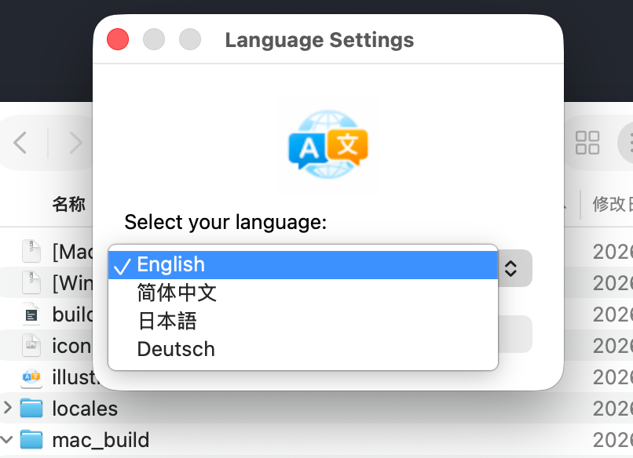
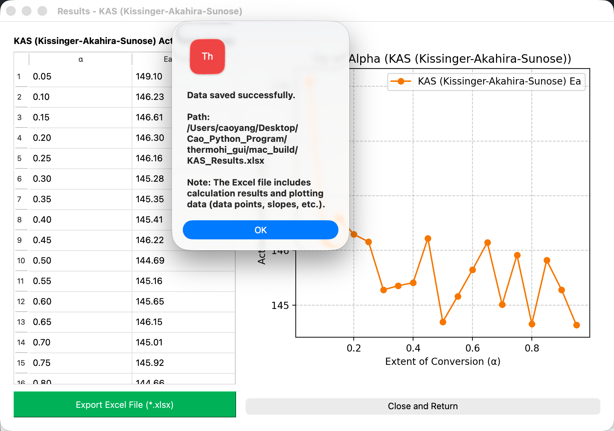
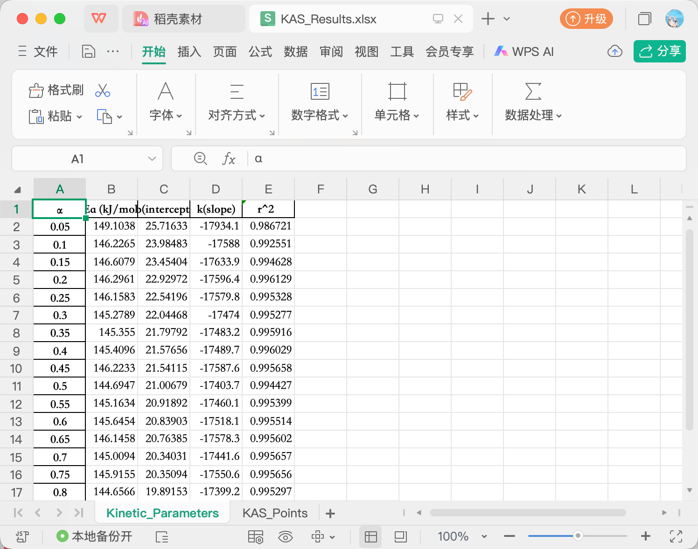
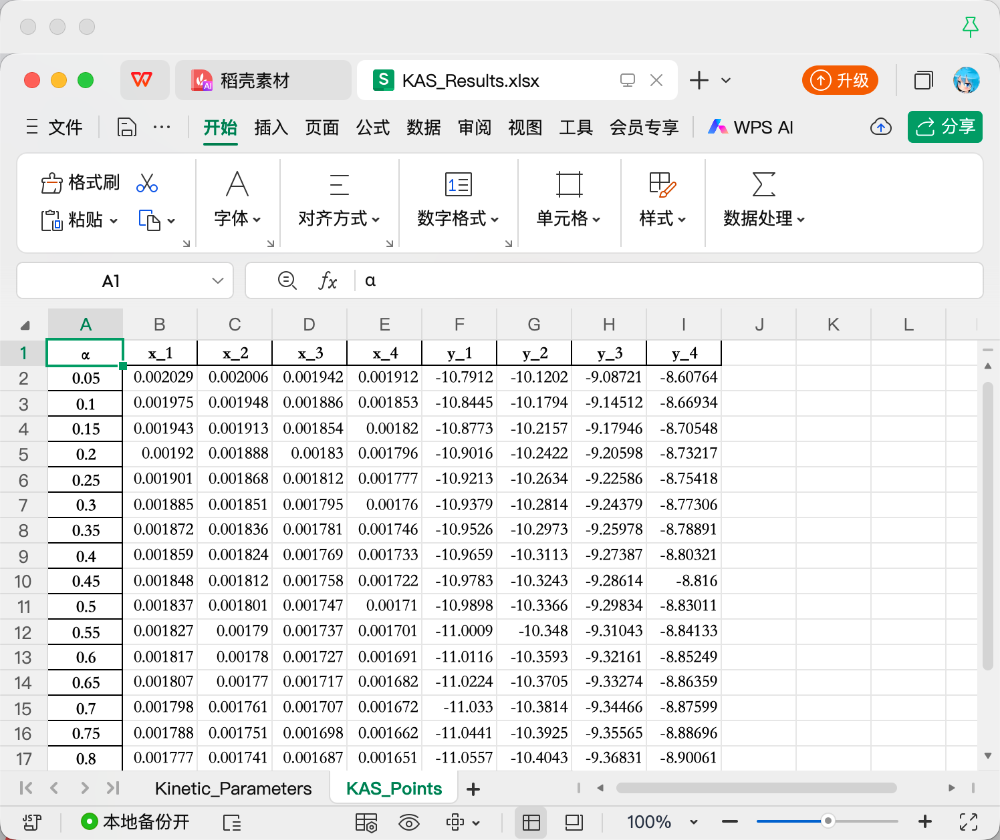
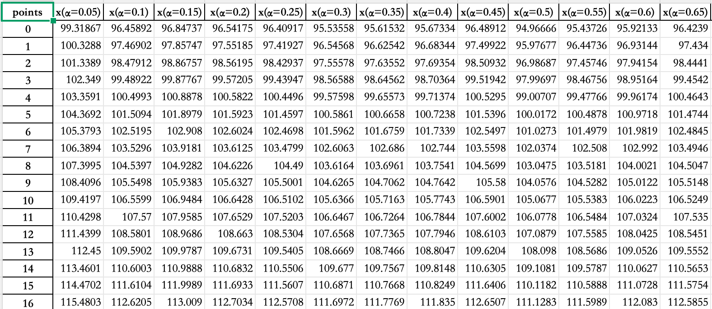

# ThermohiGUI – README

## About ThermohiGUI 

**ThermohiGUI** is a **free** graphical user interface (GUI) application for calculating activation energy ($E_a$) and exporting the corresponding results (including $E_a$ values and plotting data). Supports 🍎 MacOS (arm64) and 🪟Windows (amd64). You can download it from any of the following links:

**site1**: https://drive.google.com/drive/folders/1VGkIb_MzAON_-4iSK3veJabuobJB_w3V?usp=drive_link

**site2**: https://pan.baidu.com/s/15UHJQA5SejSC-qj5V74BTw?pwd=1919

This program implements five widely used non-isothermal kinetic analysis methods: FWO, Starink, KAS, Friedman, and Vyazovkin.
For reliable analysis, at least three heating programs are required (ICTAC recommended).

ThermohiGUI is designed to lower the barrier for activation energy calculation. Even without programming experience, users can quickly and conveniently obtain $E_a$. This is particularly beneficial for methods such as the Vyazovkin method, which become computationally complex when multiple heating programs are involved.

The software is developed by [Hikari Quicklime](https://github.com/QuicklimeHikari) (ORCID: [0000-0002-3318-4921](https://orcid.org/0000-0002-3318-4921)) and is based on the open-source Python package thermohipy (created by Hikari Quicklime, available on PyPI). For users with Python experience, [thermohipy](https://github.com/QuicklimeHikari/thermohi) is also recomended as it provides more flexibility and functions, such as drawing fitting curves.

*While efforts have been made to ensure a robust and user-friendly design (e.g., letter, symbol, zero, and negative number is not allowed in filling heating rate.), users are encouraged to carefully verify the validity and quality of their input data, as these directly affect the reliability of the calculated results.*

I hope this tool can support your research workflow—saving you time for coffee, rest, or more creative work.
### **If you find this program useful, please consider citing our related research publications.🤝**

⸻

### Interface
ThermohiGUI supports multiple languages. Users can select their preferred language within the interface.

**If you would like to suggest improvements or contribute a new language, please read the [JSON file](./en_US.json) and contact the author.**

⸻

### Data Export
Analysis results can be exported directly, allowing users to perform further visualization using external tools such as OriginPro or other plotting software. 

**Result interface**

Click on "Export excel file"button, the results will be saved as `xlsx` file and show you the path.

**Fitting results**

**Scatter data for methods except vyazokvin method**

**Vyazovkin plotting data**

if vyazovkin method is used, the fitting curves are U-shaped:

⸻
### Future plan

**ThermohiGUI is intended to remain freely available for academic and research use.**

The following features are planned for future development:

• Automatic recognition and processing of TGA and other thermo analysis data

• Non-isothermal crystallization kinetics analysis (DSC)

• Activation energy calculation for glass transitions (DMA)

• Drawing Fitting curves(implemented in [thermohipy](https://github.com/QuicklimeHikari/thermohi) but not in [ThermoGUI](https://github.com/QuicklimeHikari/thermohiGUI))

These features aim to further expand the applicability of ThermohiGUI in thermal analysis and kinetic studies.
